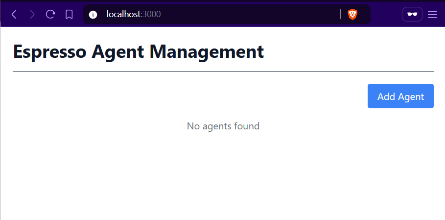
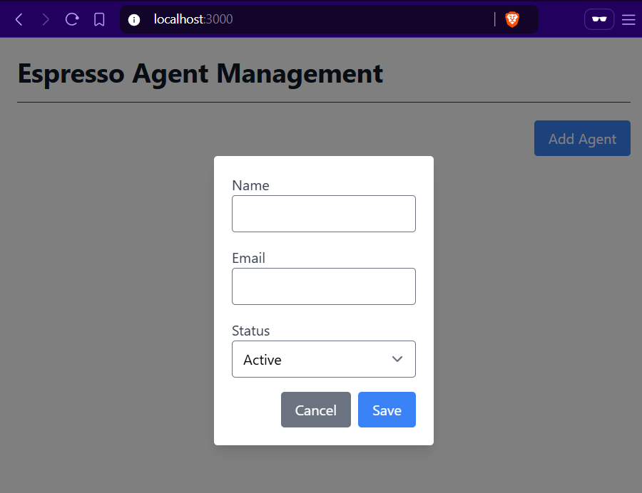
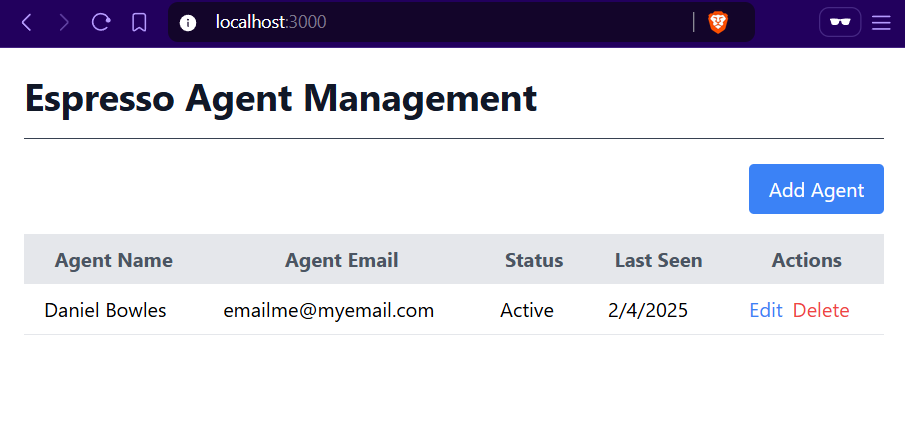
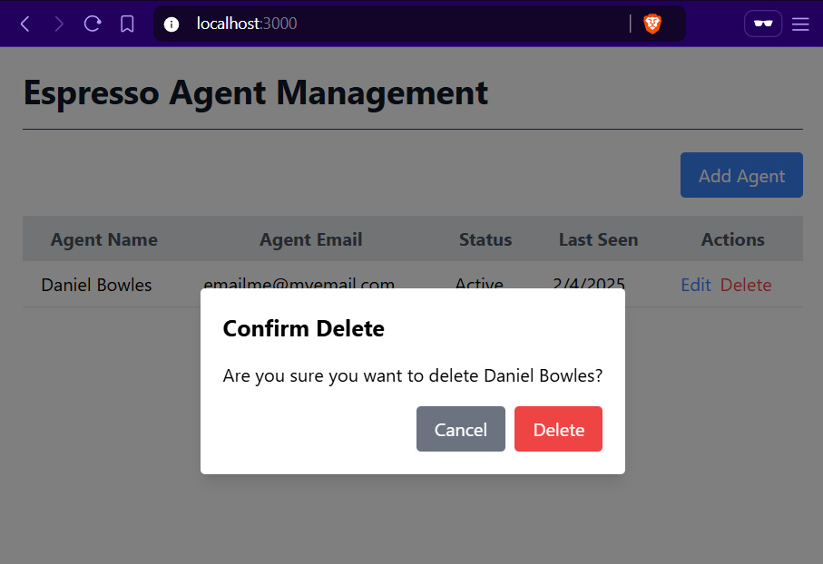

# Espresso Agent Admin

## Rationale
For this project, there was a conscious decision to keep things as simple as possible.  A starter template ([Vital](https://vital.josepvidal.dev/)) was used to easily spin up a project with TailwindCSS, React and TypeScript (and related React types) - among other tools.

I was skeptical of TailwindCSS for a while, but I have found it to be a great way to easily style elements to look well-designed (for a developer 😂).  I also really enjoy using TailwindCSS for responsive design.

As for project structure, I wanted to get things broken out in a way that made sense, but not too granular.  I went for a basic components folder along with stand-alone files for constants and types.

Validation was where time constraints took hold.  I think I would have broken out the form a bit more into more resuable, validation-aware components.  Possibly higher-order components that could be wrapped with an error state if needed.  I find the `alert` route to be very trustworthy, but also a bit too rudamentary 🙂.

Onto state management:  A simple reducer sufficed here, but I feel the form could have benefited some its own reducer as well.  I could have also used a reducer for the modal if things got more complicated on that front.  Redux felt like it would have been too heavy for this relatively small project.  I also felt the use of a Context Provider unnecessary as `App` drove the state changes to the various components.

## Instructions

1. Clone the repository:
  ```bash
  git clone git@github.com:danbowles/espresso-take-home.git
  ```
2. Navigate to the project directory:
  ```bash
  cd espresso-take-home
  ```
3. Install the dependencies:
  ```bash
  npm install --legacy-peer-deps
  ```
❓[Regarding `--legacy-peer-deps'](https://stackoverflow.com/a/75178685)

4. Start the application:
  ```bash
  npm run dev
  ```
## Images








<!--  -->

## Demo Video

https://www.loom.com/share/d0caf6b7f02c4c659f541fe8c0676d46?sid=528b8f32-1370-4cfc-bcf9-a14d5ff66785
